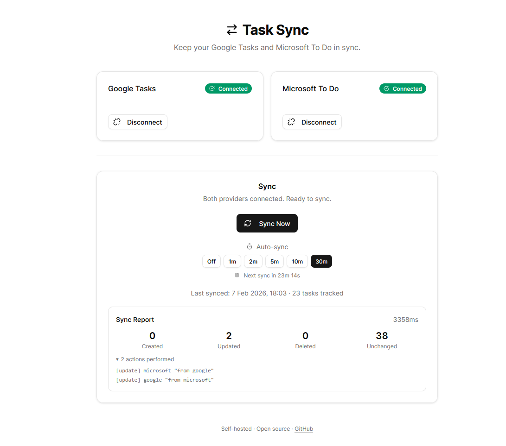

<p align="center">
  <h1 align="center">Task Sync</h1>
  <p align="center">
    Keep your <strong>Google Tasks</strong> and <strong>Microsoft To Do</strong> in sync.
    <br />
    Self-hosted. Bidirectional. Field-level conflict resolution.
  </p>
  <p align="center">
    <a href="https://github.com/salaamdev/task-sync/actions"></a>
    <a href="https://github.com/salaamdev/task-sync/blob/main/LICENSE"></a>
    = 22" />
    
  </p>
</p>

<p align="center">
  
</p>

---

## Table of Contents

- [Why Task Sync?](#why-task-sync)
- [Features](#features)
- [Architecture Overview](#architecture-overview)
- [Prerequisites](#prerequisites)
- [Quick Start — Web UI](#quick-start--web-ui)
  - [1. Create OAuth Apps](#1-create-oauth-apps)
  - [2. Configure Environment](#2-configure-environment)
  - [3. Install and Run](#3-install-and-run)
- [Quick Start — CLI](#quick-start--cli)
  - [1. Install and Build](#1-install-and-build)
  - [2. Obtain Refresh Tokens](#2-obtain-refresh-tokens)
  - [3. Configure](#3-configure)
  - [4. Run](#4-run)
- [Configuration Reference](#configuration-reference)
  - [Required Variables](#required-variables)
  - [Optional Variables](#optional-variables)
- [How Syncing Works](#how-syncing-works)
  - [Sync Algorithm](#sync-algorithm)
  - [Cold-Start Matching](#cold-start-matching)
  - [Field-Level Conflict Resolution](#field-level-conflict-resolution)
  - [Delete Propagation](#delete-propagation)
  - [Sync Modes](#sync-modes)
  - [Supported Fields](#supported-fields)
  - [Extended Fields (Google Tasks)](#extended-fields-google-tasks)
- [Sync State](#sync-state)
- [Web UI](#web-ui)
  - [OAuth Flow](#oauth-flow)
  - [Token Storage](#token-storage)
  - [Auto-Sync](#auto-sync)
  - [API Endpoints](#api-endpoints)
- [CLI Reference](#cli-reference)
- [Project Structure](#project-structure)
- [Development](#development)
  - [Running Locally](#running-locally)
  - [Testing](#testing)
  - [Linting and Type Checking](#linting-and-type-checking)
  - [Building](#building)
  - [CI/CD](#cicd)
- [Deployment](#deployment)
  - [Running as a Service](#running-as-a-service)
  - [Reverse Proxy](#reverse-proxy)
- [Security](#security)
- [FAQ](#faq)
- [Contributing](#contributing)
- [License](#license)

---

## Why Task Sync?

If you use both Google Tasks and Microsoft To Do — maybe Google Tasks on your phone and Microsoft To Do on your work laptop — you know the pain. Tasks live in two silos, and there is no native way to keep them in sync.

**Task Sync** bridges the gap. It runs on your own machine (or server), connects to both APIs with your credentials, and keeps everything synchronized. No cloud service in the middle. No third-party access to your data. Just a lightweight TypeScript engine that does one thing well.

## Features

| Feature | Description |
|---|---|
| **Bidirectional sync** | Changes in either provider flow to the other automatically |
| **Field-level conflict resolution** | Last-write-wins *per field*, not per task — no data loss |
| **Cold-start matching** | First-time sync deduplicates existing tasks by title + notes |
| **Delete propagation** | Tombstones ensure deleted tasks stay deleted across providers |
| **Dry-run mode** | Preview every change before it happens |
| **Polling / auto-sync** | Set an interval and let it run in the background |
| **Web UI** | OAuth login, one-click sync, auto-sync controls |
| **CLI** | Scriptable, cron-friendly, JSON output for automation |
| **Self-hosted** | Your data never leaves your machine |
| **Zero dependencies at runtime** | Only `commander` and `zod` — no bloat |

## Architecture Overview

```
┌─────────────────────────────────────────────────────────┐
│                       Task Sync                         │
│                                                         │
│  ┌──────────┐   ┌──────────────┐   ┌──────────────────┐ │
│  │   CLI    │   │   Web UI     │   │  Sync Engine     │ │
│  │ (cli.ts) │──▶│ (Next.js 15) │──▶│  (engine.ts)     │ │
│  └──────────┘   └──────────────┘   │                  │ │
│                                    │  Cold-start match│ │
│                                    │  Conflict resolve│ │
│                                    │  Delete propagate│ │
│                                    └────────┬─────────┘ │
│                                             │           │
│                    ┌────────────────────────┼──────┐    │
│                    │                        │      │    │
│              ┌─────▼─────┐          ┌──────▼────┐ │    │
│              │  Google    │          │ Microsoft │ │    │
│              │  Tasks API │          │ Graph API │ │    │
│              └───────────┘          └───────────┘ │    │
│                    │                        │      │    │
│                    └────────────────────────┘      │    │
│                          Providers                 │    │
│                                                    │    │
│              ┌──────────────────────┐              │    │
│              │   JSON State Store   │──────────────┘    │
│              │  (.task-sync/state)  │                   │
│              └──────────────────────┘                   │
└─────────────────────────────────────────────────────────┘
```

The engine is provider-agnostic. Google and Microsoft are implemented as `TaskProvider` interfaces, making it straightforward to add new providers in the future.

## Prerequisites

- **Node.js >= 22** (LTS recommended)
- A **Google Cloud** project with the Tasks API enabled
- A **Microsoft Azure** app registration with To Do permissions
- npm (comes with Node.js)

## Quick Start — Web UI

The web UI lets you connect your Google and Microsoft accounts via OAuth and sync tasks with one click. No manual token management required.

### 1. Create OAuth Apps

<details>
<summary><strong>Google Tasks</strong> — step-by-step</summary>

1. Go to the [Google Cloud Console](https://console.cloud.google.com/)
2. Create a new project (or select an existing one)
3. Navigate to **APIs & Services** and enable the **Google Tasks API**
4. Go to **APIs & Services → Credentials → Create Credentials → OAuth client ID**
5. Application type: **Web application**
6. Under **Authorized redirect URIs**, add:
   ```
   http://localhost:3000/api/auth/google/callback
   ```
7. Copy the **Client ID** and **Client Secret**

> **Note:** If you publish the app to production with a custom domain, update the redirect URI accordingly.

</details>

<details>
<summary><strong>Microsoft To Do</strong> — step-by-step</summary>

1. Go to [Azure Portal → App registrations](https://portal.azure.com/#blade/Microsoft_AAD_RegisteredApps/ApplicationsListBlade)
2. Click **New registration**
3. Name: `Task Sync` (or anything you like)
4. Supported account types: **Personal Microsoft accounts only** (or multi-tenant if needed)
5. Redirect URI → Platform: **Web** → URI:
   ```
   http://localhost:3000/api/auth/microsoft/callback
   ```
6. After creation, go to **API permissions** → **Add a permission** → **Microsoft Graph** → **Delegated permissions**:
   - `Tasks.ReadWrite`
   - `User.Read`
   - `offline_access`
7. Go to **Certificates & secrets** → **New client secret** → copy the **Value**
8. Copy the **Application (client) ID** from the Overview page

> **Note:** For personal Microsoft accounts, use `consumers` as the tenant ID. For work/school accounts, use your Azure AD tenant ID.

</details>

### 2. Configure Environment

Create a `.env.local` file in the project root:

```bash
TASK_SYNC_PROVIDER_A=google
TASK_SYNC_PROVIDER_B=microsoft

# Google Tasks
TASK_SYNC_GOOGLE_CLIENT_ID=your-google-client-id
TASK_SYNC_GOOGLE_CLIENT_SECRET=your-google-client-secret

# Microsoft To Do
TASK_SYNC_MS_CLIENT_ID=your-microsoft-client-id
TASK_SYNC_MS_CLIENT_SECRET=your-microsoft-client-secret
TASK_SYNC_MS_TENANT_ID=consumers
```

> A `.env.local.example` template is included in the repo for reference.

### 3. Install and Run

```bash
git clone https://github.com/salaamdev/task-sync.git
cd task-sync
npm install
npm run web:install
npm run web:dev
```

Open [http://localhost:3000](http://localhost:3000). Click **Connect** for each provider, approve the OAuth consent screen, then hit **Sync Now**.

#### Production Build

```bash
npm run web:build
npm run web:start
```

The production server runs on port 3000 by default.

---

## Quick Start — CLI

For headless environments, scripts, cron jobs, or if you prefer the terminal.

### 1. Install and Build

```bash
git clone https://github.com/salaamdev/task-sync.git
cd task-sync
npm install
npm run build
```

### 2. Obtain Refresh Tokens

Helper scripts are included to walk you through the OAuth flow in your browser:

```bash
# Google Tasks
export TASK_SYNC_GOOGLE_CLIENT_ID=your-client-id
export TASK_SYNC_GOOGLE_CLIENT_SECRET=your-client-secret
npm run oauth:google
```

```bash
# Microsoft To Do
export TASK_SYNC_MS_CLIENT_ID=your-client-id
export TASK_SYNC_MS_TENANT_ID=consumers
npm run oauth:microsoft
```

Each script starts a local server, opens your browser for consent, and prints the refresh token when done.

### 3. Configure

Add everything to `.env.local`:

```bash
TASK_SYNC_PROVIDER_A=google
TASK_SYNC_PROVIDER_B=microsoft

TASK_SYNC_GOOGLE_CLIENT_ID=your-client-id
TASK_SYNC_GOOGLE_CLIENT_SECRET=your-client-secret
TASK_SYNC_GOOGLE_REFRESH_TOKEN=your-refresh-token

TASK_SYNC_MS_CLIENT_ID=your-client-id
TASK_SYNC_MS_TENANT_ID=consumers
TASK_SYNC_MS_REFRESH_TOKEN=your-refresh-token
```

### 4. Run

```bash
# Validate your configuration
node dist/cli.js doctor

# Preview changes without applying them
node dist/cli.js sync --dry-run

# Sync once
node dist/cli.js sync

# Auto-sync every 5 minutes
node dist/cli.js sync --poll 5

# JSON output (for scripting / piping)
node dist/cli.js sync --format json
```

---

## Configuration Reference

All configuration is done through environment variables. Place them in a `.env.local` file in the project root (git-ignored by default).

### Required Variables

| Variable | Description |
|---|---|
| `TASK_SYNC_PROVIDER_A` | First provider: `google` or `microsoft` |
| `TASK_SYNC_PROVIDER_B` | Second provider: `google` or `microsoft` |
| `TASK_SYNC_GOOGLE_CLIENT_ID` | Google OAuth client ID |
| `TASK_SYNC_GOOGLE_CLIENT_SECRET` | Google OAuth client secret |
| `TASK_SYNC_MS_CLIENT_ID` | Microsoft application (client) ID |

### Optional Variables

| Variable | Default | Description |
|---|---|---|
| `TASK_SYNC_MS_CLIENT_SECRET` | — | Microsoft client secret (required for web UI) |
| `TASK_SYNC_MS_TENANT_ID` | `consumers` | Azure AD tenant ID |
| `TASK_SYNC_GOOGLE_REFRESH_TOKEN` | — | Google refresh token (CLI only) |
| `TASK_SYNC_MS_REFRESH_TOKEN` | — | Microsoft refresh token (CLI only) |
| `TASK_SYNC_GOOGLE_TASKLIST_ID` | `@default` | Google Tasks list ID to sync |
| `TASK_SYNC_MS_LIST_ID` | *(first list)* | Microsoft To Do list ID to sync |
| `TASK_SYNC_STATE_DIR` | `.task-sync` | Directory for sync state files |
| `TASK_SYNC_LOG_LEVEL` | `info` | Log verbosity: `silent`, `error`, `warn`, `info`, `debug` |
| `TASK_SYNC_POLL_INTERVAL_MINUTES` | — | Auto-sync interval in minutes (CLI only) |
| `TASK_SYNC_MODE` | `bidirectional` | Sync mode (see [Sync Modes](#sync-modes)) |
| `TASK_SYNC_TOMBSTONE_TTL_DAYS` | `30` | Days to retain delete tombstones |
| `TASK_SYNC_HTTP_RPS` | — | Rate limit (requests per second) for API calls |

---

## How Syncing Works

### Sync Algorithm

Each sync run follows these steps:

1. **Lock** — acquire a file-based lock to prevent concurrent syncs
2. **Load state** — read mappings, tombstones, and `lastSyncAt` from `.task-sync/state.json`
3. **Prune tombstones** — remove expired tombstones (older than `TASK_SYNC_TOMBSTONE_TTL_DAYS`)
4. **Fetch tasks** — incremental fetch using `lastSyncAt` as a watermark (full fetch on first run)
5. **Cold-start match** — on the first sync, match existing tasks across providers by title + notes
6. **Detect deletes** — find tasks that were deleted and create tombstones
7. **Detect orphans** — handle tasks missing from one or both providers
8. **Reconcile fields** — for each mapped task, diff every field against the last known canonical snapshot
9. **Resolve conflicts** — if multiple providers changed the same field, apply [conflict resolution](#field-level-conflict-resolution)
10. **Fan out** — push the resolved canonical state to all providers
11. **Save state** — persist updated mappings, tombstones, and new `lastSyncAt`

### Cold-Start Matching

When you first run Task Sync, you probably already have tasks in both Google Tasks and Microsoft To Do. Instead of duplicating everything, the engine:

1. Groups all tasks by a normalized key of `title + notes`
2. Matches tasks that have the same key across providers
3. Creates internal mappings for matched tasks
4. Only creates new tasks for genuinely unmatched items

This means your first sync won't flood either provider with duplicates.

### Field-Level Conflict Resolution

Unlike simpler sync tools that operate at the task level (entire task wins or loses), Task Sync resolves conflicts **per field**:

- Each field (title, notes, status, due date, etc.) is compared individually against the last canonical snapshot
- If only one provider changed a field → that change wins
- If multiple providers changed the *same* field → **last-write-wins** based on `updatedAt` timestamp
- Conflicts are logged to `.task-sync/conflicts.log` for transparency

**Example:** You update a task's title in Google Tasks and its due date in Microsoft To Do. Both changes are preserved — no data loss.

### Delete Propagation

Deleting a task in one provider should delete it in the other. Task Sync handles this with **tombstones**:

1. When a previously-synced task disappears from a provider, the engine creates a tombstone record
2. The delete is propagated to all other providers
3. Tombstones are retained for `TASK_SYNC_TOMBSTONE_TTL_DAYS` (default: 30) to prevent the task from being "resurrected" if it reappears in a cached API response
4. Expired tombstones are pruned automatically

### Sync Modes

| Mode | Behavior |
|---|---|
| `bidirectional` | Changes flow both ways (default) |
| `a-to-b-only` | Changes from Provider A are pushed to Provider B, but not vice versa |
| `mirror` | Provider A is the source of truth; Provider B mirrors it exactly |

Set via `TASK_SYNC_MODE` in your `.env.local`.

### Supported Fields

| Field | Google Tasks | Microsoft To Do | Notes |
|---|:---:|:---:|---|
| `title` | Yes | Yes | |
| `notes` | Yes | Yes | |
| `status` | Yes | Yes | `active` / `completed` |
| `dueAt` | Yes | Yes | Date only (time via extended fields) |
| `dueTime` | Extended | Yes | Stored in Google notes metadata |
| `reminder` | — | Yes | Preserved via round-trip metadata |
| `recurrence` | — | Yes | Preserved via round-trip metadata |
| `categories` | — | Yes | Preserved via round-trip metadata |
| `importance` | — | Yes | `low` / `normal` / `high` |
| `steps` | — | Yes | Checklist items (read-only sync) |
| `startAt` | — | Yes | Preserved via round-trip metadata |

### Extended Fields (Google Tasks)

Google Tasks has a limited API (title, notes, status, due date). To preserve Microsoft To Do's richer fields, Task Sync stores them in a metadata block appended to the Google Tasks notes field:

```
Your actual notes content here...

[task-sync]
dueTime=14:30
reminder=2026-02-07T14:00:00Z
importance=high
[/task-sync]
```

This metadata block is:
- Invisible to casual use (at the bottom of notes)
- Parsed and stripped during sync
- Enables lossless round-tripping of fields that Google Tasks doesn't natively support

---

## Sync State

Task Sync stores all local state in the `.task-sync/` directory (configurable via `TASK_SYNC_STATE_DIR`):

```
.task-sync/
├── state.json      # Mappings, tombstones, lastSyncAt watermark
├── tokens.json     # OAuth refresh tokens (web UI only)
├── conflicts.log   # Conflict resolution audit log
└── state.lock      # File-based lock (prevents concurrent syncs)
```

### `state.json` Structure

```jsonc
{
  "version": 1,
  "lastSyncAt": "2026-02-07T18:03:00.000Z",
  "mappings": [
    {
      "canonicalId": "uuid-v4",
      "byProvider": {
        "google": "google-task-id",
        "microsoft": "microsoft-task-id"
      },
      "canonical": {
        "title": "Buy groceries",
        "notes": "Milk, eggs, bread",
        "status": "active",
        "dueAt": "2026-02-08",
        "updatedAt": "2026-02-07T18:03:00.000Z"
      },
      "updatedAt": "2026-02-07T18:03:00.000Z"
    }
  ],
  "tombstones": [
    {
      "provider": "google",
      "id": "deleted-task-id",
      "deletedAt": "2026-02-01T12:00:00.000Z"
    }
  ]
}
```

**Resetting sync state:** Delete the `.task-sync/` directory to start fresh. The next sync will perform a full cold-start match.

---

## Web UI

The web UI is built with **Next.js 15** (App Router), **React 19**, **Tailwind CSS 4**, and **shadcn/ui** components.

### OAuth Flow

1. Click **Connect** for a provider
2. You're redirected to Google/Microsoft's OAuth consent screen
3. After approval, you're redirected back to the app
4. The refresh token is stored locally in `.task-sync/tokens.json`

### Token Storage

- Tokens are stored in `.task-sync/tokens.json` on disk
- They **never leave your machine** — the web server uses them server-side only
- Treat this file like a password (it's git-ignored by default)

### Auto-Sync

The web UI supports automatic polling. Choose an interval (1m, 2m, 5m, 10m, 30m) and the app will sync in the background. The countdown timer shows when the next sync will occur.

### API Endpoints

| Method | Path | Description |
|---|---|---|
| `GET` | `/api/auth/google` | Initiates Google OAuth flow |
| `GET` | `/api/auth/google/callback` | Google OAuth callback |
| `GET` | `/api/auth/microsoft` | Initiates Microsoft OAuth flow |
| `GET` | `/api/auth/microsoft/callback` | Microsoft OAuth callback |
| `DELETE` | `/api/disconnect/[provider]` | Removes stored tokens for a provider |
| `GET` | `/api/status` | Returns connection status and last sync info |
| `POST` | `/api/sync` | Triggers a sync and returns the report |

---

## CLI Reference

```
Usage: task-sync [command] [options]

Commands:
  doctor              Validate configuration and connectivity
  sync                Run a sync cycle

Sync options:
  --dry-run           Preview changes without applying them
  --poll <minutes>    Auto-sync on an interval
  --format <format>   Output format: text (default) or json
```

**Examples:**

```bash
# Check that everything is configured correctly
task-sync doctor

# One-shot sync
task-sync sync

# Preview what would change
task-sync sync --dry-run

# Continuous sync every 10 minutes
task-sync sync --poll 10

# Machine-readable output
task-sync sync --format json
```

**Using via npm scripts (development):**

```bash
npm run dev -- doctor
npm run dev -- sync --dry-run
npm run dev -- sync --poll 5
```

---

## Project Structure

```
task-sync/
├── .github/
│   └── workflows/
│       └── ci.yml              # GitHub Actions CI pipeline
├── scripts/
│   ├── dev/                    # Development utilities
│   │   ├── e2e.ts              # End-to-end test helper
│   │   ├── mutate.ts           # Task mutation helper
│   │   └── purge_all_lists.ts  # Purge all tasks (dev only)
│   ├── google_oauth.ts         # CLI OAuth flow for Google
│   └── microsoft_oauth.ts      # CLI OAuth flow for Microsoft
├── src/                        # Core engine + CLI
│   ├── cli.ts                  # CLI entry point (Commander.js)
│   ├── config.ts               # Env config validation (Zod)
│   ├── env.ts                  # .env file loader
│   ├── extended-fields.ts      # Google Tasks metadata block handling
│   ├── http.ts                 # HTTP client with retries & rate limiting
│   ├── log.ts                  # Structured logging
│   ├── model.ts                # Task data model & TypeScript types
│   ├── providers/
│   │   ├── provider.ts         # TaskProvider interface
│   │   ├── google.ts           # Google Tasks API implementation
│   │   ├── microsoft.ts        # Microsoft Graph API implementation
│   │   └── mock.ts             # In-memory mock (for testing)
│   ├── store/
│   │   ├── jsonStore.ts        # JSON file-based state persistence
│   │   └── lock.ts             # File-based mutual exclusion lock
│   └── sync/
│       └── engine.ts           # Core sync algorithm
├── test/                       # Test suite (Vitest)
│   ├── engine.test.ts          # Sync engine unit tests
│   ├── engine.hardening.test.ts# Edge case & hardening tests
│   ├── googleProvider.test.ts  # Google provider tests
│   ├── microsoftProvider.test.ts# Microsoft provider tests
│   ├── jsonStore.test.ts       # State store tests
│   └── web.test.ts             # Web UI / API route tests
├── web/                        # Next.js web UI
│   ├── app/
│   │   ├── api/                # API routes (OAuth, sync, status)
│   │   ├── layout.tsx          # Root layout
│   │   ├── page.tsx            # Dashboard page
│   │   └── globals.css         # Global styles
│   ├── components/
│   │   ├── dashboard.tsx       # Main dashboard component
│   │   └── ui/                 # shadcn/ui primitives
│   ├── lib/
│   │   ├── env.ts              # Web environment config
│   │   ├── tokens.ts           # Token storage (read/write)
│   │   └── utils.ts            # Utility functions
│   ├── next.config.ts
│   ├── package.json
│   └── tsconfig.json
├── .env.local.example          # Environment variable template
├── .gitignore
├── eslint.config.js
├── LICENSE                     # Apache License 2.0
├── package.json
├── tsconfig.json
└── tsup.config.ts              # Build configuration
```

---

## Development

### Running Locally

```bash
# Install all dependencies
npm install
npm run web:install

# Run CLI in development mode (uses tsx, no build step)
npm run dev -- doctor
npm run dev -- sync --dry-run

# Run web UI in development mode (builds core engine first)
npm run web:dev
```

### Testing

Tests use [Vitest](https://vitest.dev/) with an in-memory mock provider — no real API credentials needed for the test suite.

```bash
# Run all tests once
npm test

# Watch mode (re-runs on file changes)
npm run test:watch
```

### Linting and Type Checking

```bash
# ESLint
npm run lint

# TypeScript type checking (no emit)
npm run typecheck
```

### Building

```bash
# Build the core engine (CLI) with tsup → dist/
npm run build

# Build core + Next.js web UI for production
npm run web:build
```

### CI/CD

The project uses **GitHub Actions** for continuous integration. Every push and pull request triggers:

1. `npm ci` — clean install
2. `npm run lint` — ESLint checks
3. `npm run typecheck` — TypeScript validation
4. `npm test` — full test suite
5. `npm run build` — production build verification

---

## Deployment

### Running as a Service

**Using systemd (Linux):**

```ini
[Unit]
Description=Task Sync Web UI
After=network.target

[Service]
Type=simple
WorkingDirectory=/path/to/task-sync
ExecStart=/usr/bin/node dist/cli.js sync --poll 5
Restart=on-failure
EnvironmentFile=/path/to/task-sync/.env.local

[Install]
WantedBy=multi-user.target
```

**Using cron (CLI mode):**

```bash
# Sync every 15 minutes
*/15 * * * * cd /path/to/task-sync && node dist/cli.js sync >> /var/log/task-sync.log 2>&1
```

**Using PM2:**

```bash
pm2 start "npm run web:start" --name task-sync
pm2 save
pm2 startup
```

### Reverse Proxy

If you expose the web UI beyond localhost, **always put it behind authentication**. The web UI has no built-in auth.

<details>
<summary><strong>Caddy</strong> (recommended — automatic HTTPS)</summary>

```
tasks.example.com {
    basicauth {
        admin $2a$14$... # caddy hash-password
    }
    reverse_proxy localhost:3000
}
```
</details>

<details>
<summary><strong>nginx</strong></summary>

```nginx
server {
    listen 443 ssl;
    server_name tasks.example.com;

    auth_basic "Task Sync";
    auth_basic_user_file /etc/nginx/.htpasswd;

    location / {
        proxy_pass http://localhost:3000;
        proxy_set_header Host $host;
        proxy_set_header X-Real-IP $remote_addr;
    }
}
```
</details>

---

## Security

| Principle | Detail |
|---|---|
| **Self-hosted only** | Designed to run on your own machine or server — no SaaS component |
| **No telemetry** | Zero tracking. The only outbound requests go to Google and Microsoft APIs |
| **Tokens on disk** | Refresh tokens are stored in `.task-sync/tokens.json` — treat it like a password file |
| **No built-in auth** | The web UI has no login screen. If exposed to the internet, use a reverse proxy with authentication |
| **File-based locking** | Prevents concurrent sync runs from corrupting state |
| **Minimal dependencies** | Only 2 runtime dependencies (`commander`, `zod`) — smaller attack surface |

### Best Practices

- Keep `.env.local` and `.task-sync/` out of version control (both are in `.gitignore`)
- Use a firewall or VPN if running on a remote server
- Regularly rotate OAuth credentials if you suspect compromise
- Review `.task-sync/conflicts.log` periodically for unexpected conflict patterns

---

## FAQ

<details>
<summary><strong>What happens if I delete <code>.task-sync/</code>?</strong></summary>

The next sync will behave like a first-time sync: cold-start matching by title + notes, no tombstones. Existing tasks won't be duplicated if they have the same title and notes in both providers.
</details>

<details>
<summary><strong>Can I sync multiple task lists?</strong></summary>

Currently, Task Sync syncs one list per provider. Set `TASK_SYNC_GOOGLE_TASKLIST_ID` and `TASK_SYNC_MS_LIST_ID` to choose which lists. To sync multiple lists, run separate instances with different state directories (`TASK_SYNC_STATE_DIR`).
</details>

<details>
<summary><strong>What if both providers change the same task at the same time?</strong></summary>

Task Sync uses field-level conflict resolution with a last-write-wins policy. Each field is compared independently, so if you change the title in Google and the due date in Microsoft, both changes are preserved. If both change the same field, the most recent edit wins. All conflicts are logged to `.task-sync/conflicts.log`.
</details>

<details>
<summary><strong>Does it support recurring tasks?</strong></summary>

Recurrence rules from Microsoft To Do are preserved and round-tripped, but they are stored as metadata in Google Tasks (which doesn't natively support recurrence). The recurrence will function in Microsoft To Do and be preserved if the task is edited in Google Tasks.
</details>

<details>
<summary><strong>How do I sync with a work/school Microsoft account?</strong></summary>

Set `TASK_SYNC_MS_TENANT_ID` to your Azure AD tenant ID instead of `consumers`. Make sure your Azure app registration supports the appropriate account types.
</details>

<details>
<summary><strong>Can I run the CLI and web UI at the same time?</strong></summary>

Not recommended. Both use the same state directory and file lock, so only one sync process should run at a time. The file lock prevents concurrent corruption, but running both may cause unexpected behavior.
</details>

<details>
<summary><strong>Is there a Docker image?</strong></summary>

Not yet — contributions welcome! The app is a standard Node.js project, so containerizing it is straightforward.
</details>

<details>
<summary><strong>My Google refresh token expired. What do I do?</strong></summary>

Google refresh tokens can expire if the app is in "Testing" mode in the Cloud Console and hasn't been used for 7 days. Either re-run `npm run oauth:google` (CLI) or click **Disconnect** then **Connect** again (web UI). To avoid this, publish your OAuth consent screen (even as internal-only).
</details>

---

## Contributing

Contributions are welcome! Here's how to get started:

1. **Fork** the repository
2. **Create a feature branch:** `git checkout -b feat/my-feature`
3. **Install dependencies:** `npm install && npm run web:install`
4. **Make your changes** and add tests
5. **Run the checks:**
   ```bash
   npm run lint
   npm run typecheck
   npm test
   ```
6. **Commit** with a clear message
7. **Open a Pull Request** against `main`

### Ideas for Contribution

- Docker / docker-compose setup
- Additional providers (Todoist, Apple Reminders, etc.)
- Multi-list sync support
- Webhook-based sync (instead of polling)
- Better conflict resolution UI in the web dashboard
- Task list selection in the web UI

---

## License

Licensed under the [Apache License 2.0](LICENSE).

```
Copyright 2025 salaamdev

Licensed under the Apache License, Version 2.0 (the "License");
you may not use this file except in compliance with the License.
You may obtain a copy of the License at

    http://www.apache.org/licenses/LICENSE-2.0
```
